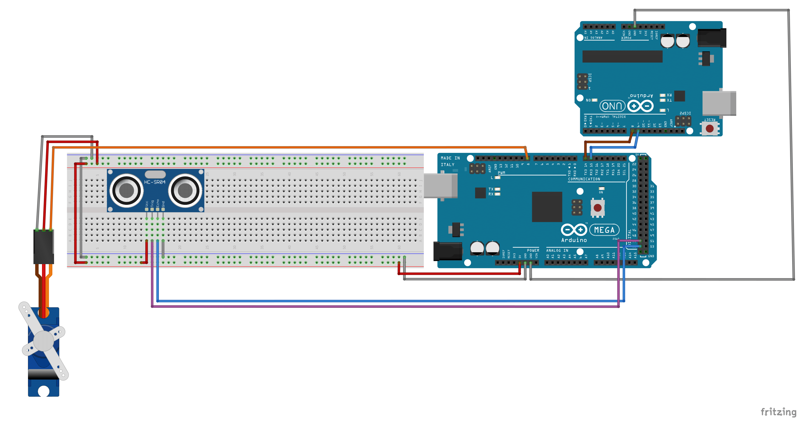
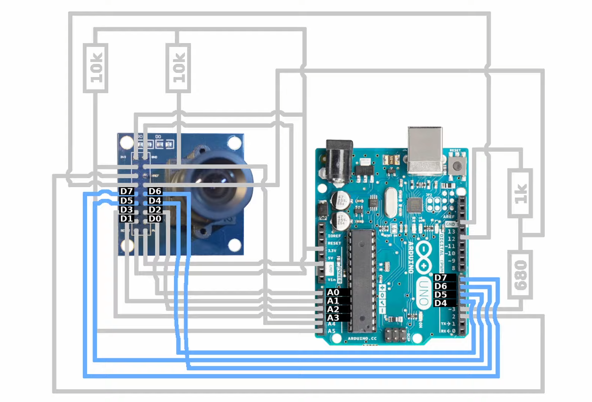
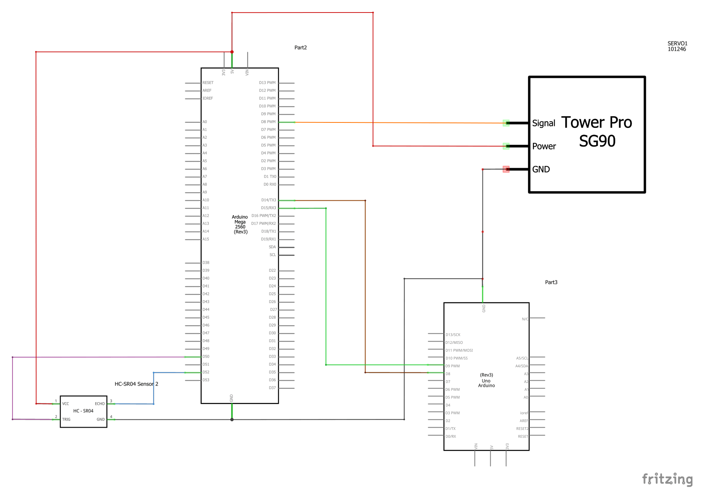
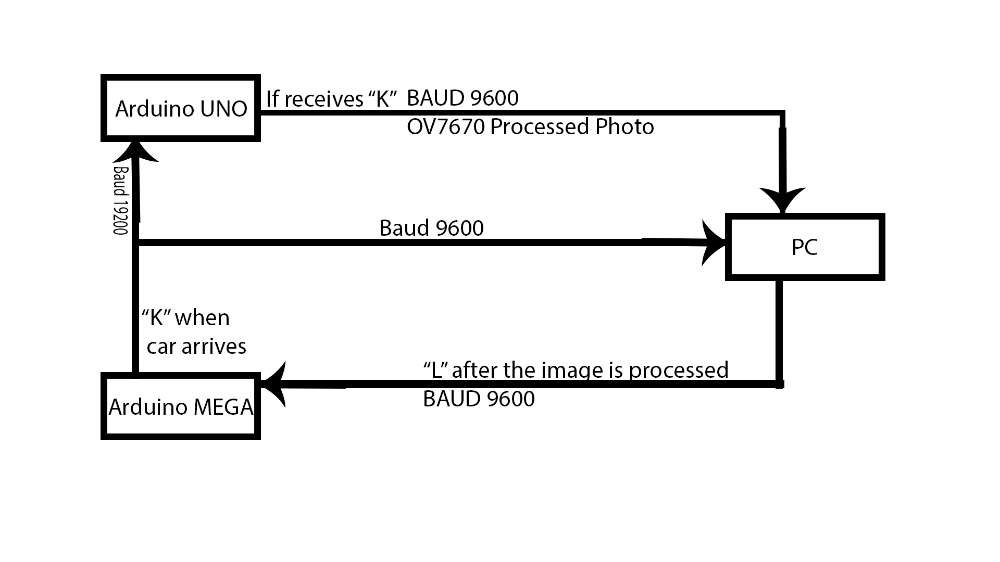

# Smart Gate System with License Plate Recognition

This project automates gate control using an ultrasonic sensor, OV7670 camera, and servo motor. The system detects a car's arrival, captures its license plate, checks it against a database, and opens the gate if authorized.

## Table of Contents
- [Components Used](#components-used)
- [Circuit & OV7670 Diagram](#circuit--ov7670-diagram)
- [Schematic View](#schematic-view)
- [Installation](#installation)
- [Usage](#usage)
- [Communication Between Arduinos and Computer](#communication-between-arduinos-and-computer)
- [License](#license)
- [Credits](#credits)

## Components Used
- 1x Arduino UNO
- 1x Arduino MEGA
- 1x OV7670 Camera Module
- 1x HC-SR04 Ultrasonic Sensor
- 1x Servo SG90 9g
- 2x Breadboard
- 15x Male-to-female jumper wires
- 15x Male-to-male jumper wires

## Circuit & OV7670 Diagram

## Schematic View

## Installation
1. **Assemble the components**: Connect the OV7670, ultrasonic sensor, and servo motor following the circuit and OV7670 diagrams.
2. **Upload the Arduino UNO code**: Use the Arduino IDE to upload the provided sketch (`src/LiveOV7670-master/src/LiveOV7670/LiveOV7670.ino`) to your Arduino UNO.
3. **Upload the Arduino MEGA code**: Use the Arduino IDE to upload the provided sketch (`src/Data_receiver/Data_receiver.ino`) to your Arduino MEGA.
4. **Get the tool for image processing**: Download it from [here](https://circuitjournal.com/arduino-OV7670-to-pc) and follow the instructions. If you need more guidance, refer to the tutorial I used [here](https://www.youtube.com/watch?v=R94WZH8XAvM). It provides a detailed explanation for setting up the OV7670 module, but don't use his code, use the one provided within this repository, otherwise the communication won't happen.
5. **Install Python if it isn't installed and its modules**:
   - matplotlib 
   - easyocr
   - imutils
   - cv2
   - sqlite3
   - serial
   - PyQt5
6. **Connect both Arduinos to the PC**

## Usage
1. **Place the system**: Position the ultrasonic sensor and OV7670 camera so that they can detect vehicles approaching the gate and capture the license plate. You can watch `video.mp4` for a reference.
2. **Start listening for images**: Open the tool and press "Listen" using a baud rate of 500000 and your COM port connected to Arduino UNO (you can check it in Arduino IDE -> Tools -> Port).
3. **Start the Python script**: Open `main.py` from `src/Data_processing/main.py`.
4. **Automatic gate control**: When a vehicle is detected, the system captures the license plate using the OV7670 camera, checks the number against a pre-existing database, and opens the gate if authorized.

## Communication Between Arduinos and Computer
The system communicates with the computer to manage a database of authorized license plates and processes the captured image data for verification. The camera data is transmitted to the PC for further number plate recognition.

You can see the logic behind this communication here:

## License
This project is licensed under the [MIT License](LICENSE).

## Credits
- **Author**: Felix-Marian STOENOIU
- **Email**: Stoenoiu.Felix1@gmail.com
- **GitHub**: [My GitHub profile](https://github.com/FelixMarian)
